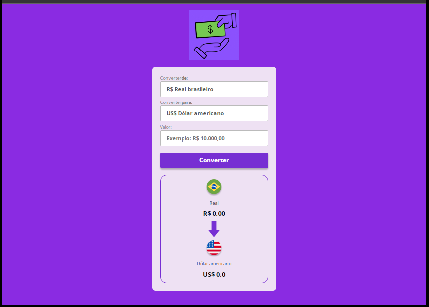

<h1 align="center"># 💱 Projeto 05 — Conversor de Moedas</h1>

⚙️ Projeto desenvolvido como exercício prático para fixar conceitos de <strong>HTML</strong>, <strong>CSS</strong> e, principalmente, <strong>JavaScript</strong>, com foco na <strong>lógica de programação</strong> e manipulação do DOM.

---

## 🚀 📊  Linguagens usadas

| Linguagem    | Porcentagem estimada |
| ------------ | -------------------- |
| 📄 HTML      | 20%                  |
| 🎨 CSS       | 20%                  |
| ✨ JavaScript | 60%                  |

---

## 🌟 Funcionalidades
  
*   ✅Campo para digitar o valor em Real
*   ✅Seleção de moeda de destino (Dólar ou Euro)
*  ✅ Conversão com base em valores fixos
*   ✅Validação para impedir conversão com valor inválido
*   ✅Exibição de mensagens de erro personalizadas
*   ✅Troca dinâmica da bandeira da moeda e do nome exibido
*   ✅Formatação numérica com Intl.NumberFormat

---

## 🫠 Aprendizados

Durante o desenvolvimento, aprendi:

🔹 A capturar eventos com addEventListener
🔹 A usar condicionais para controle de fluxo
🔹 Manipular elementos do DOM com JavaScript
🔹 Trabalhar com estruturas básicas como funções e variáveis
🔹 Validar entrada de dados do usuário
🔹 Utilizar Intl.NumberFormat para exibir valores monetários

---

## 👀 Visualização do projeto:

* 💻 Versão desktop:

